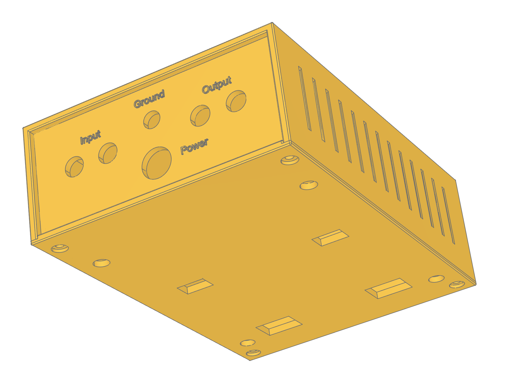
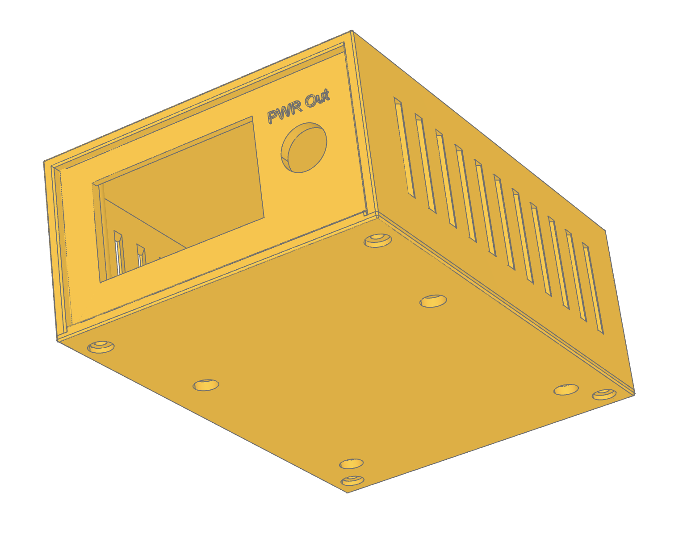
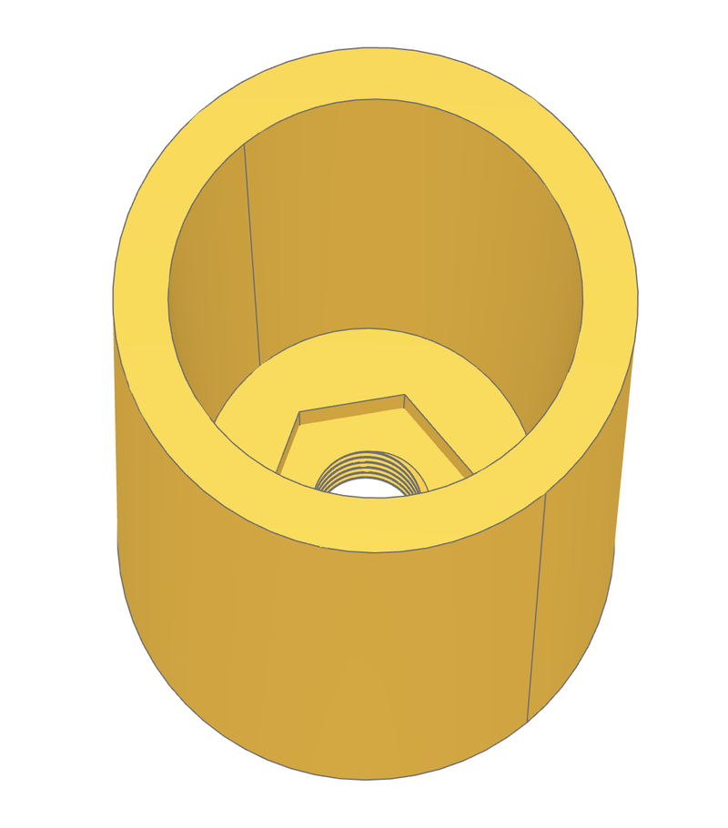
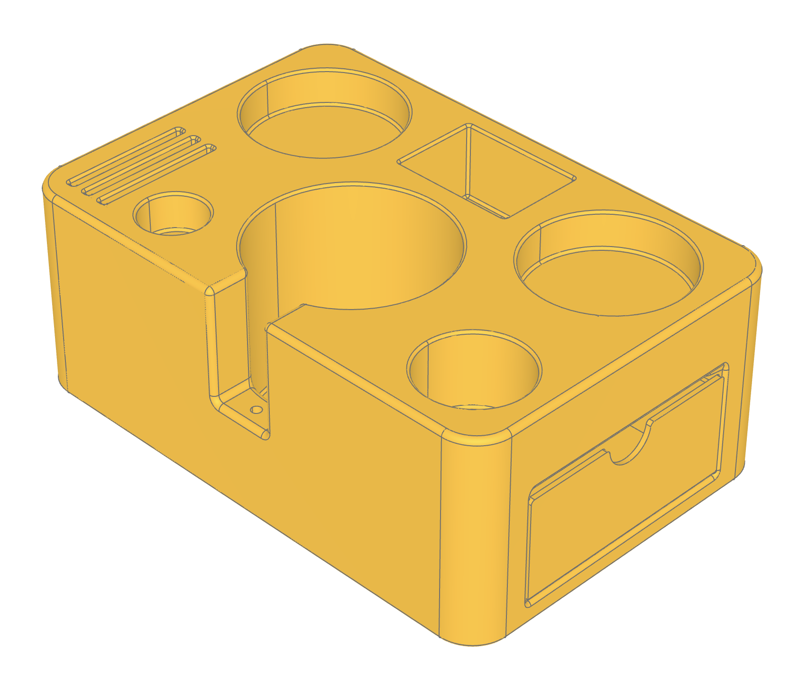
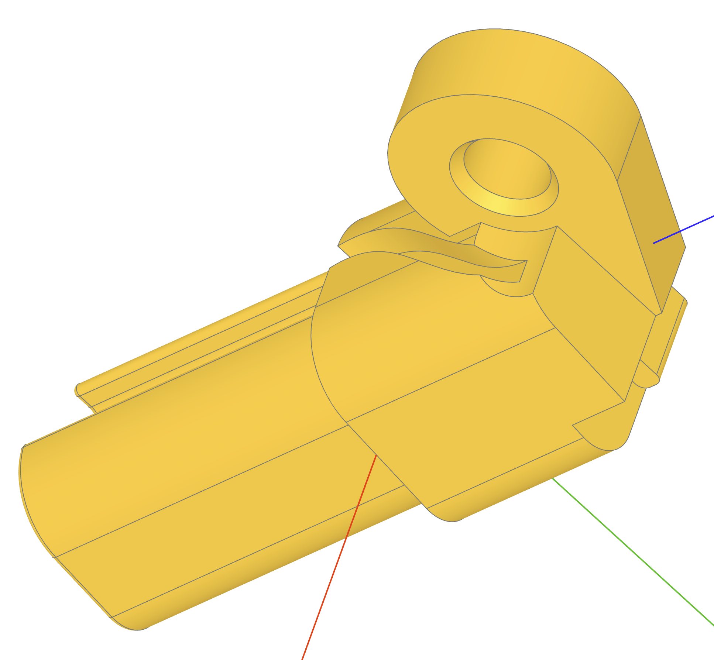

# CadQuery Designs Aimed for 3D-Printing

## Requirements
* `cadquery` – install it with miniforge/conda for a hassle-free setup
* I use VSCode + OCP CAD Viewer plugin, but `CQ-editor` should work as well

## cq_utils.py
Just a convenient utility module to share code snippets across the designs

## honeycomb.py
Utility module for applying honeycomb infill pattern to a given wall

## phono-preamp-psu.py
DIY phono-preamp and separate PSU cases.

## cone-column.py
Two hollow cone columns, one with a built-in ISO-thread and the other with a recess for a nut. I use these as limiters on my roller shutters.

## step-display-stand.py
Step display stand generator with various parameters available to configure

## tampering-station.py
Home baristas' best friend, a tampering station with some additional slots to store tools and accessories like leveler,
tamper, screens, porta filters, etc.

## ikea-kvartal-hook-adapter.py
IKEA Kvartal (a curtain hanging system) is discontinued since 2016, but it was a high-quality product and I don't want simply throw it out. So here is a hook adapter for Kvartal's gliders.

## mb-a205-windshield-lug.py
Two lugs for Mercedes-Benz wind shield (A2058680009), which is for A205 cabrio.
There are several different types of plastic lugs in this wind shield, but you won't confuse them visually.

